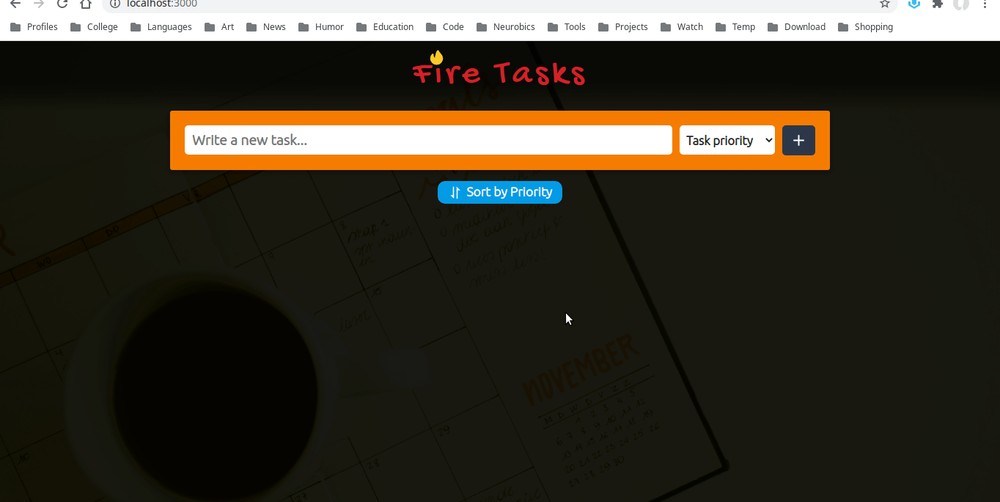

# :fire: Fire Tasks

An awesome task manager application built using ReactJS (with Hooks), Firebase and Styled Components.

A [live demo](https://fire-tasks-a3674.web.app/) is worth a thousand pictures.

## :zap: Main features

- Add new tast
- Edit task
- Remove task
- Sort by priority

## :heavy_check_mark: Covered concepts

- React Hooks: useState, useEffect, useContext
- Firestore

## :package: Other dependencies

- react-toastify
- styled-icons
